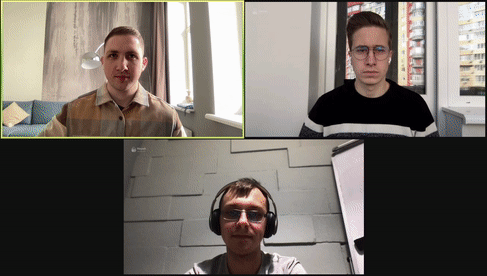
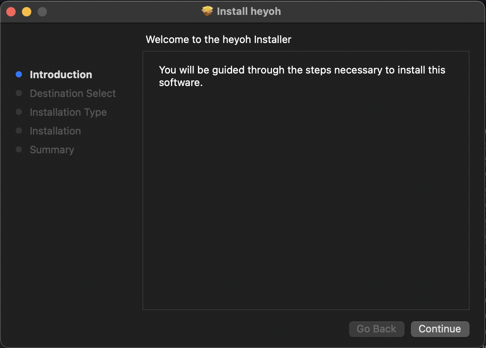
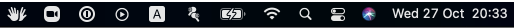
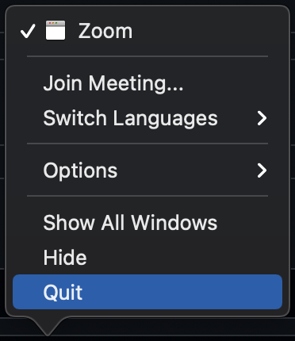

## Heyoh Camera

Heyoh is an open source virtual camera based on PyTorch. Bring real-life gestures to your video calls with heyoh virtual camera.
<p align="center">

</p>

## [DOWNLOAD FOR MAC](https://l.linklyhq.com/l/dcFk)

Contributors: Marko Kostiv, Danylo Bondar, Oleh Sehelin, Ksenia Demska

PyTorch Annual Hackathon 2021

## How to use

### Installation
- Install Heyoh Camera
<p align="center">

</p>

- Heyoh Camera will run in a tray
<p align="center">

</p>

- Restart Zoom or Google Chrome
<p align="center">

</p>

### Zoom
- Go to Preferences -> Video -> Select Heyoh Camera
<p align="center">

</p>

### Meets
- Go to Settings -> Video -> Select Heyoh Camera
<p align="center">

</p>

### Compatibility
Heyoh camera works with any other virtual camera, such as OBS, mmhmm or Snap. Open Heyoh Camera in tray and select the video source.

### Uninstall

- Remove application from Applications folder
```
rm -r /Applications/Heyoh.app
```
- Remove Heyoh Plugin from /Library/CoreMediaIO/Plug-Ins/DAL/
```
rm -r /Library/CoreMediaIO/Plug-Ins/DAL/Heyoh\ Camera.plugin
```

## Source code

- [heyoh-camera](https://github.com/heyoh-app/heyoh-camera) - code for the macOS app and DAL plugin (virtual camera).
- [gestures-detector](https://github.com/heyoh-app/gestures-detector) - training and inference code for heyoh-camera app.

