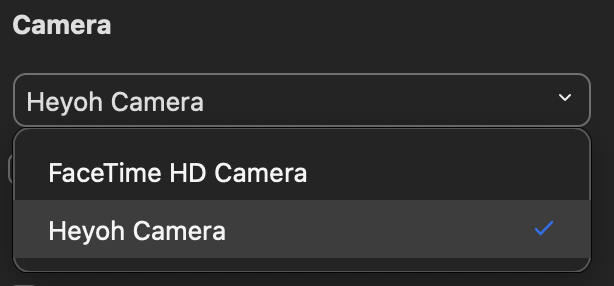
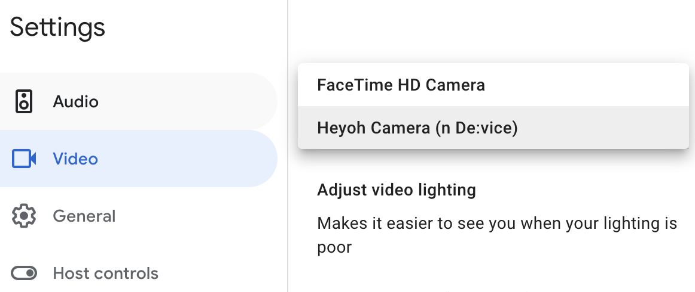

## Heyoh Camera

Heyoh is an open source virtual camera based on PyTorch. It is the code for the macOS app and DAL plugin (virtual camera).

## [DOWNLOAD INSTALLER](https://l.linklyhq.com/l/dcFk)

Contributors: Marko Kostiv, Danylo Bondar, Oleh Sehelin, Ksenia Demska

PyTorch Annual Hackathon 2021
## How to use

### Zoom
- Restart Zoom application after installing Heyoh Camera
- Go to Preferences -> Video -> Select Heyoh Camera
<p align="center">

</p>

### Meets
- Restart your browser after installing Heyoh Camera
- Go to Settings -> Video -> Select Heyoh Camera
<p align="center">

</p>

### Compatibility
Heyoh camera works with any other virtual camera, such as OBS, mmhmm or Snap. Open Heyoh Camera in tray and select the video source.


### Markdown

Markdown is a lightweight and easy-to-use syntax for styling your writing. It includes conventions for

```markdown
Syntax highlighted code block

# Header 1
## Header 2
### Header 3

- Bulleted
- List

1. Numbered
2. List

**Bold** and _Italic_ and `Code` text

[Link](url) and 
```

For more details see [GitHub Flavored Markdown](https://guides.github.com/features/mastering-markdown/).

### Jekyll Themes

Your Pages site will use the layout and styles from the Jekyll theme you have selected in your [repository settings](https://github.com/heyoh-app/heyoh.github.io/settings/pages). The name of this theme is saved in the Jekyll `_config.yml` configuration file.

### Support or Contact

Having trouble with Pages? Check out our [documentation](https://docs.github.com/categories/github-pages-basics/) or [contact support](https://support.github.com/contact) and we’ll help you sort it out.
